# DirectorDesk

3D 导演台：用剧本、资源库和预设机位，帮助非 3D 专业用户制作可控的 AI 视频分镜。

P0 已走通：**Markdown 剧本 → 本地/官方资源 → 预设机位 → 镜头关联 → 分镜画布 → PNG 导出**。权威需求与架构见 [`docs/dev-map/`](docs/dev-map/)。

Windows 用户可直接从 [Releases](https://github.com/wisdom-km/mira_new/releases) 下载 `DirectorDesk-0.1.1-windows-x64.exe` 安装包。

## 架构

运行时模块关系如下。蓝色为应用层，琥珀色为创作域，绿色为资产与场景，玫瑰色为平台与渲染，靛蓝为导出与服务。节点标注对应源文件；更细的模块边界与契约见 [docs/dev-map/01-ARCHITECTURE-MAP.md](docs/dev-map/01-ARCHITECTURE-MAP.md)。

```mermaid
flowchart TD

subgraph group_app["Application"]
  node_main["Desktop entry point<br/>C++ executable<br/>[main.cpp]"]
  node_application["Application loop<br/>application coordinator<br/>[Application.cpp]"]
  node_project["Project persistence<br/>project binding<br/>[ProjectFile.cpp]"]
  node_ui_panels["ImGui workflow panels<br/>desktop UI<br/>[WorkspacePanel.cpp]"]
end

subgraph group_domain["Authoring Domains"]
  node_script["Script document<br/>Markdown script domain<br/>[Document.cpp]"]
  node_script_parser["Markdown parser<br/>script parser<br/>[Parser.cpp]"]
  node_shot_link["Shot links<br/>script-to-shot binding<br/>[ShotLink.cpp]"]
  node_storyboard["Storyboard composer<br/>board assembly<br/>[BoardComposer.cpp]"]
  node_camera["Camera authoring<br/>camera presets and controls<br/>[CameraManager.cpp]"]
end

subgraph group_assets["Assets and Scene"]
  node_asset_library[("Asset library<br/>asset catalog<br/>[Library.cpp]")]
  node_asset_loaders["Model importers<br/>OBJ/GLB loader registry<br/>[LoaderRegistry.cpp]"]
  node_official_catalog["Official asset catalog<br/>remote asset acquisition"]
  node_scene["Scene document<br/>scene state<br/>[Document.cpp]"]
end

subgraph group_platform["Platform and Rendering"]
  node_renderer_api{{"Renderer interface<br/>rendering contract<br/>[IRenderer.h]"}}
  node_graphics_backend["bgfx renderer<br/>graphics backend<br/>[BgfxRenderer.cpp]"]
  node_window_backend["GLFW window backend<br/>window platform backend<br/>[GlfwWindow.cpp]"]
  node_async_work["Background work queues<br/>worker and UI handoff<br/>[Worker.cpp]"]
  node_http_client{{"HTTP client contract<br/>network abstraction<br/>[IHttpClient.h]"}}
  node_curl_http["curl HTTP backend<br/>HTTP implementation<br/>[CurlHttpClient.cpp]"]
end

subgraph group_extension["Export and Services"]
  node_export["PNG shot export<br/>storyboard export<br/>[ShotExport.cpp]"]
  node_ai_services{{"AI generation services<br/>image/video service contracts<br/>[IImageGenService.h]"}}
end

node_main -->|"starts"| node_application
node_application -->|"loads"| node_project
node_project -->|"persists"| node_script
node_project -->|"persists"| node_scene
node_project -->|"persists"| node_storyboard
node_script_parser -->|"parses into"| node_script
node_script -->|"stable IDs"| node_shot_link
node_scene -->|"scene binding"| node_shot_link
node_camera -->|"camera binding"| node_shot_link
node_shot_link -->|"linked shots"| node_storyboard
node_asset_loaders -->|"imports models"| node_asset_library
node_asset_library -->|"supplies assets"| node_scene
node_official_catalog -->|"acquires assets"| node_asset_library
node_official_catalog -->|"downloads via"| node_http_client
node_curl_http -->|"implements"| node_http_client
node_application -->|"hosts"| node_ui_panels
node_ui_panels -->|"edits"| node_script
node_ui_panels -->|"edits"| node_scene
node_ui_panels -->|"edits"| node_storyboard
node_ui_panels -->|"renders through"| node_renderer_api
node_graphics_backend -->|"implements"| node_renderer_api
node_application -->|"creates window"| node_window_backend
node_application -->|"dispatches"| node_async_work
node_storyboard -->|"exports shots"| node_export
node_application -.->|"invokes"| node_ai_services

click node_main "https://github.com/wisdom-km/mira_new/blob/main/src/App/main.cpp"
click node_application "https://github.com/wisdom-km/mira_new/blob/main/src/App/Application.cpp"
click node_project "https://github.com/wisdom-km/mira_new/blob/main/src/App/ProjectFile.cpp"
click node_script "https://github.com/wisdom-km/mira_new/blob/main/src/Script/Document.cpp"
click node_script_parser "https://github.com/wisdom-km/mira_new/blob/main/src/Script/Parser.cpp"
click node_shot_link "https://github.com/wisdom-km/mira_new/blob/main/src/Link/ShotLink.cpp"
click node_storyboard "https://github.com/wisdom-km/mira_new/blob/main/src/Storyboard/BoardComposer.cpp"
click node_camera "https://github.com/wisdom-km/mira_new/blob/main/src/Camera/CameraManager.cpp"
click node_asset_library "https://github.com/wisdom-km/mira_new/blob/main/src/Asset/Library.cpp"
click node_asset_loaders "https://github.com/wisdom-km/mira_new/blob/main/src/Asset/LoaderRegistry.cpp"
click node_official_catalog "https://github.com/wisdom-km/mira_new/blob/main/src/Asset/OfficialCatalog.cpp"
click node_scene "https://github.com/wisdom-km/mira_new/blob/main/src/Scene/Document.cpp"
click node_ui_panels "https://github.com/wisdom-km/mira_new/blob/main/src/UI/WorkspacePanel.cpp"
click node_renderer_api "https://github.com/wisdom-km/mira_new/blob/main/include/DirectorDesk/Renderer/IRenderer.h"
click node_graphics_backend "https://github.com/wisdom-km/mira_new/blob/main/backends/bgfx/BgfxRenderer.cpp"
click node_window_backend "https://github.com/wisdom-km/mira_new/blob/main/backends/glfw/GlfwWindow.cpp"
click node_async_work "https://github.com/wisdom-km/mira_new/blob/main/src/Platform/Worker.cpp"
click node_export "https://github.com/wisdom-km/mira_new/blob/main/src/Export/ShotExport.cpp"
click node_ai_services "https://github.com/wisdom-km/mira_new/blob/main/include/DirectorDesk/AI/IImageGenService.h"
click node_http_client "https://github.com/wisdom-km/mira_new/blob/main/include/DirectorDesk/Platform/IHttpClient.h"
click node_curl_http "https://github.com/wisdom-km/mira_new/blob/main/backends/curl/CurlHttpClient.cpp"

classDef toneNeutral fill:#f8fafc,stroke:#334155,stroke-width:1.5px,color:#0f172a
classDef toneBlue fill:#dbeafe,stroke:#2563eb,stroke-width:1.5px,color:#172554
classDef toneAmber fill:#fef3c7,stroke:#d97706,stroke-width:1.5px,color:#78350f
classDef toneMint fill:#dcfce7,stroke:#16a34a,stroke-width:1.5px,color:#14532d
classDef toneRose fill:#ffe4e6,stroke:#e11d48,stroke-width:1.5px,color:#881337
classDef toneIndigo fill:#e0e7ff,stroke:#4f46e5,stroke-width:1.5px,color:#312e81
classDef toneTeal fill:#ccfbf1,stroke:#0f766e,stroke-width:1.5px,color:#134e4a
class node_main,node_application,node_project,node_ui_panels toneBlue
class node_script,node_script_parser,node_shot_link,node_storyboard,node_camera toneAmber
class node_asset_library,node_asset_loaders,node_official_catalog,node_scene toneMint
class node_renderer_api,node_graphics_backend,node_window_backend,node_async_work,node_http_client,node_curl_http toneRose
class node_export,node_ai_services toneIndigo
```



## 要求

- Windows 10/11 或 macOS
- CMake ≥ 3.24
- C++17 编译器：MSVC 或 Apple Clang
- [vcpkg](https://github.com/microsoft/vcpkg)
- Windows 本地 Ninja 构建还需 Ninja；也可用 Visual Studio 生成器

## 构建

完整步骤见 [docs/BUILD.md](docs/BUILD.md)。Windows 最快路径：

```powershell
git clone https://github.com/wisdom-km/mira_new.git
cd mira_new
$env:VCPKG_ROOT = "C:\path\to\vcpkg"
cmake --preset windows-debug
cmake --build --preset windows-debug
ctest --preset windows-debug --output-on-failure
.\build\windows-debug\DirectorDesk.exe --project .\examples\cafe.ddproj
```

macOS：

```bash
export VCPKG_ROOT=/path/to/vcpkg
cmake --preset macos-debug
cmake --build --preset macos-debug
ctest --preset macos-debug --output-on-failure
./build/macos-debug/DirectorDesk --project ./examples/cafe.ddproj
```

首次配置会由 vcpkg 编译依赖，需要联网。

## 使用

见 [docs/USER-GUIDE.md](docs/USER-GUIDE.md)。核心路径：

1. 打开 `examples/cafe.ddproj` 或自己的 Markdown 剧本
2. 从资源库导入本地模型，或在「在线」页下载官方 CC0 立方体
3. 用预设机位摆镜头，并关联到剧本 Shot
4. 在分镜画布总览，导出 1080p/2K 单镜头或分镜总览 PNG

## 文档

| 文档 | 内容 |
|------|------|
| [docs/BUILD.md](docs/BUILD.md) | Windows / macOS 构建 |
| [docs/USER-GUIDE.md](docs/USER-GUIDE.md) | 用户路径与快捷键 |
| [CONTRIBUTING.md](CONTRIBUTING.md) | 贡献约定 |
| [docs/THIRD_PARTY.md](docs/THIRD_PARTY.md) | 第三方与资产许可证 |
| [docs/RELEASE-CHECKLIST.md](docs/RELEASE-CHECKLIST.md) | P0 发布检查清单 |
| [docs/dev-map/](docs/dev-map/) | 愿景、架构、路线图 |
| [docs/dev-map/01-ARCHITECTURE-MAP.md](docs/dev-map/01-ARCHITECTURE-MAP.md) | 模块边界、依赖方向与架构总览图 |

shader 由 CMake 调用 shaderc 编译，不要提交生成的二进制。

许可证：MIT。
